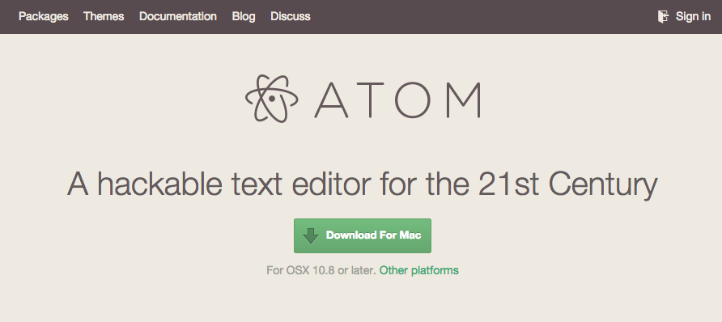
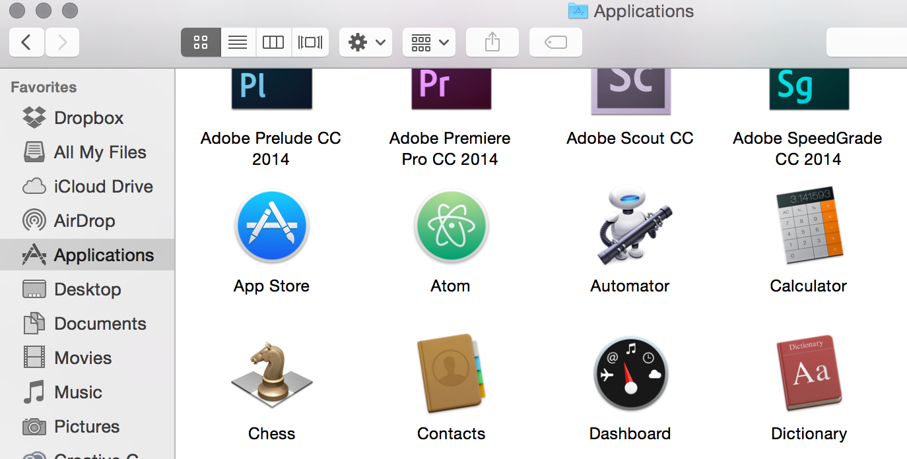
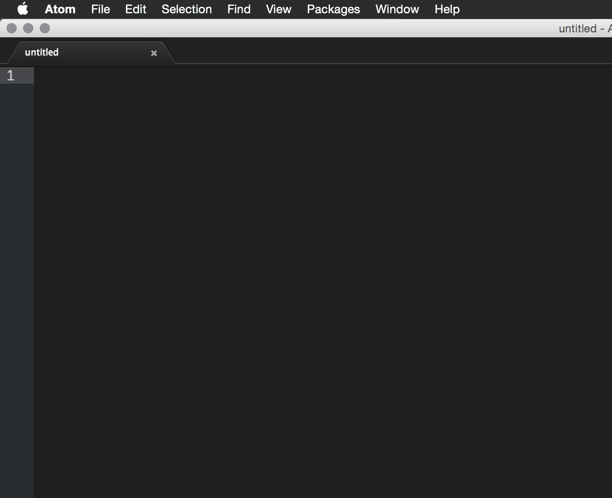

## Atom Installation

Installing Atom is super easy. First naviate over to the [atom.io](https://atom.io/) site and download the Application.

Once it is downloaded, unzip the file and drag that file into the OS-X Applications directory, the installation will then begin and Atom will now be launchable via the Spotlight.

Now you can launch the Atom editor from the Applications directory or the Spotlight.

### [⇐ Previous](fish.md) | [Next ⇒](git.md)
