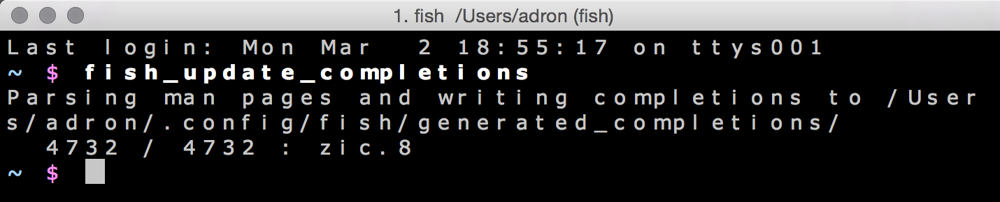
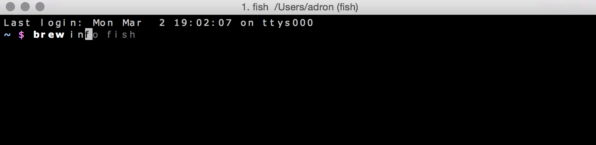
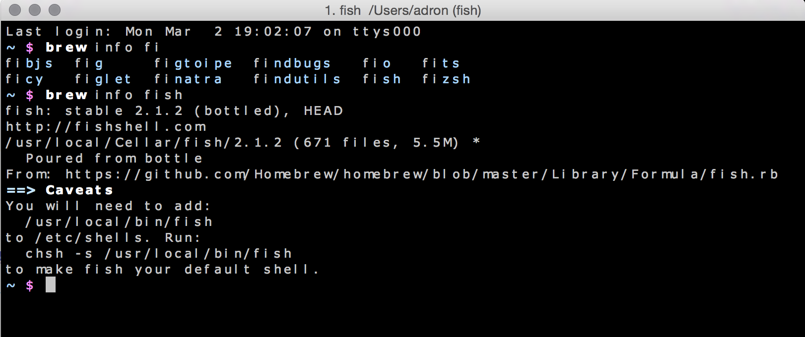

## Install Fish

Using Homebrew, you can now install [Fish](http://fishshell.com/), a smart and user-friendly command line shell. Remember, a shell is simply the user interface between you and your computer's operating system.

There are many command line shells availabe to choose from, each with their own strengths. Since it's easy to switch back and forth at any time, we recommend you give Fish a try for this workshop.

To get started, run the following command.

```
brew install fish
```

Run the following command to let your computer know it's safe to use Fish as your default shell.

```
echo '/usr/local/bin/fish' | sudo tee -a /etc/shells
```

**TIP:** This will require your account password which **will not** appear on the screen as you type.

Finally, run this command to make Fish your default shell.

```
chsh -s /usr/local/bin/fish
```

To verify the new prompt is installed correctly, relaunch the Terminal.

Here's a quick break down of what you're seeing.

| Component             | Description                            |
| --------------------- | -------------------------------------- |
| `Wed Jan 28 08:53:47` | Date of your last login                |
| `ttys006`             | Name of your last terminal session     |
| `~` (home directory)  | Name of your working directory         |
| `$`                   | Prompt symbol                          |


### Update the auto-completions

Fish's auto-completions enhance the user experience of most command line tools.

To update fish's completions, run the following command.

```
fish_update_completions
```

And you'll see something like this.



### Leverage your history

Fish keeps a record of every command you've ever run. You can use that history to your advantage.

Start by typing the following command one more time.

```
brew in
```

This time you'll see an auto-suggestion based on the most recent matching command.



To use the auto-suggestion, press the right arrow ➡ key and hit the Enter key.



**TIP:** Use the up arrow ⬆ and the down arrow ⬇ keys to cycle through your entire history of commands.

### [⇐ Previous](homebrew.md) | Next [Sublime Text ⇒](sublime.md) | or Next [WebStorm ⇒](webstorm.md) | or Next [Atom ⇒](atom.md)
