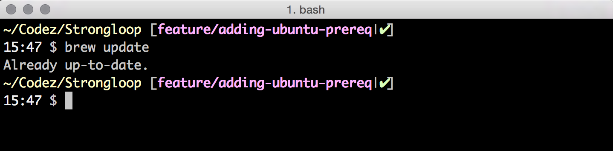

## Install Homebrew

Now that your Terminal is setup, it's time to install [Homebrew](http://brew.sh/), the de facto package manager for OS X. If you've never heard of a package manager, think of it as an App Store of **free** command line programs.

To get started, run the following command.

```
ruby -e "$(curl -fsSL https://raw.github.com/Homebrew/install/master/install)"
```

**TIP:** Be sure to agree when asked to install the **XCode CommandLine Tools**. This takes about 30 minutes to download and install on average.

## Update Homebrew

If you've previously installed Homebrew, now's a good time to update it by running the following command.

```
brew update
```

If it's been a while since the last update, you'll see a number of packages updated. Otherwise, you'll see something like this.



**TIP:** Run this command periodically as Homebrew doesn't auto-update itself.

## Verify Homebrew

To verify Homebrew is installed correctly, run the following command.

```
brew doctor
```

And you'll see a message stating "Your system is ready to brew."


## [⇐ Previous](terminal.md) | [Next ⇒](fish.md)
