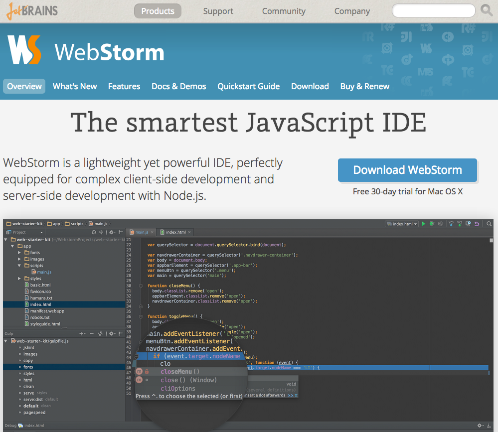

## WebStorm Installation

### Prerequisites

* Java

Installing WebStorm is pretty easy, it's a standard download and drag and drop the application into the Application directory. However you'll need to install Java first in order for WebStorm to execute. So be sure to have Java installed before installing and attempting to execute WebStorm.

### Download & Installation

### [⇐ Previous](fish.md) | [Next ⇒](git.md)
