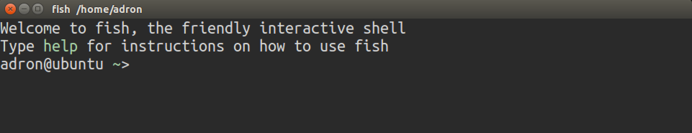
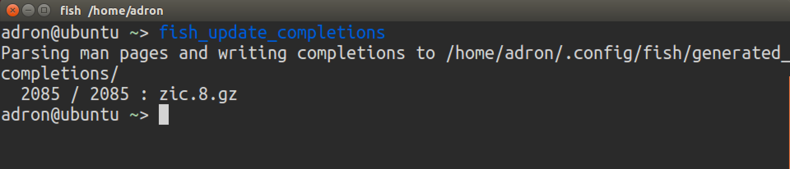
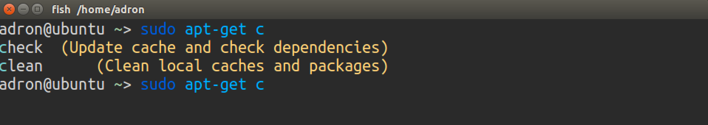
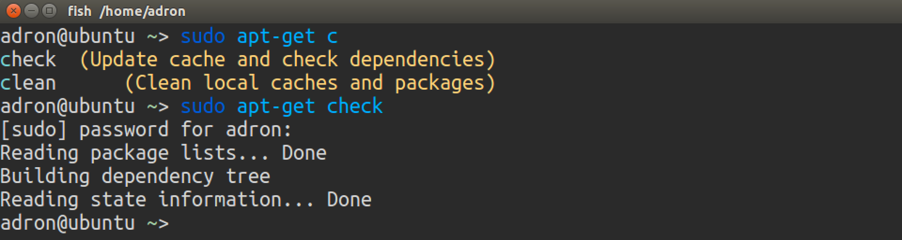

## Install Fish

Using APT, you can now install [Fish](http://fishshell.com/), a smart and user-friendly command line shell. Remember, a shell is simply the user interface between you and your computer's operating system.

There are many command line shells availabe to choose from, each with their own strengths. Since it's easy to switch back and forth at any time, we recommend you give Fish a try for this workshop.

To get started, run the following commands.

```
sudo apt-get install -y fish git
```

Finally, run this command to make Fish your default shell.

```
chsh -s /usr/bin/fish
```

**TIP:** This will also require your account password which **will not** appear on the screen as you type.

Now, restart Ubuntu, relaunch your Terminal, and you'll see something like this.



Welcome to Fish!

### Update the auto-completions

Fish's auto-completions enhance the user experience of most command line tools.

To update fish's completions, run the following command.

```
fish_update_completions
```

And you'll see something like this.



To try out auto-completions, start typing the following command.

```
sudo apt-get c
```

And press the Tab key and you'll see something like this.



Finish typing the following command and press the Enter key.

```
sudo apt-get check
```

**TIP:** This may require your account password which **will not** appear on the screen as you type.

And you'll see something like this.



**TIP:** Use the up arrow ⬆ and the down arrow ⬇ keys to cycle through your entire history of commands.

### [⇐ Previous](apt.md) | Next [Sublime Text ⇒](sublime.md) | or Next [WebStorm ⇒](webstorm.md) | or Next [Atom ⇒](atom.md)
