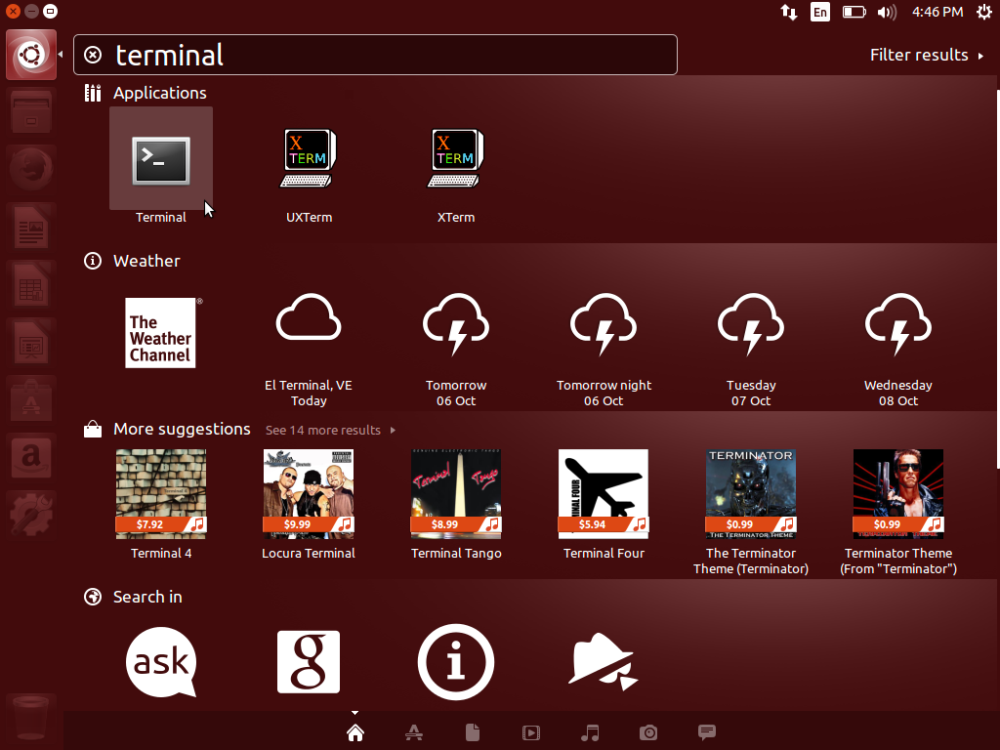
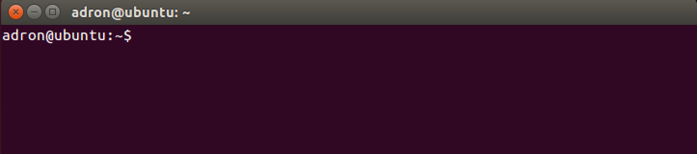
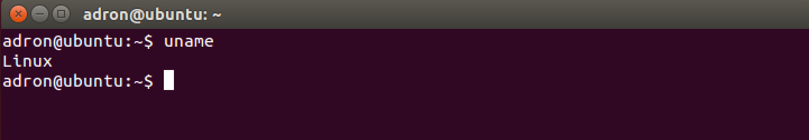
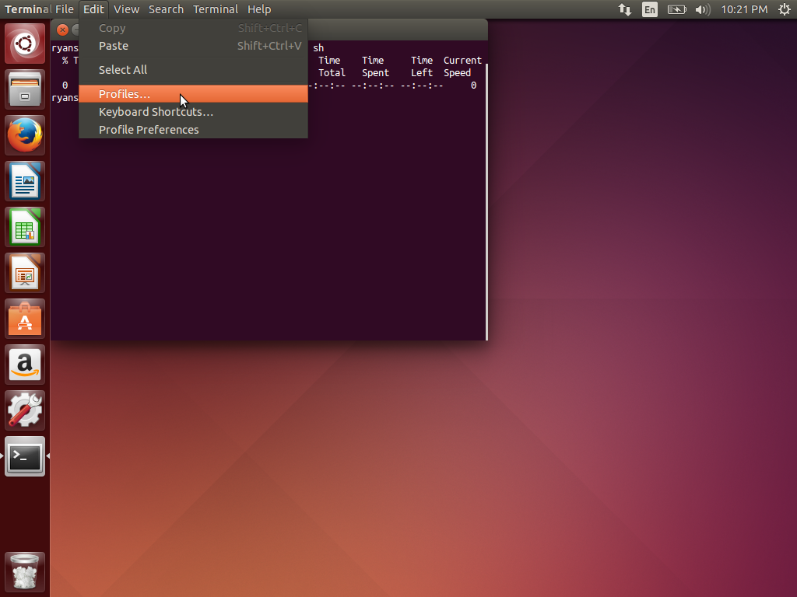
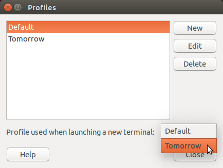
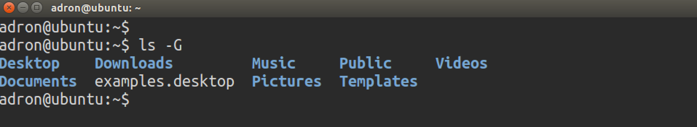

# Setup for Ubuntu

This guide will help you setup a software development environment on [Ubuntu 14.04 Trusty Tahr](http://releases.ubuntu.com/14.04/). By the end, your computer will be configured with the same state-of-the-art tools used by professional software developers. This guide is mostly compatible with older versions of Ubuntu.

## The Terminal

Included in Ubuntu is the **Terminal** -- an app that runs a Unix shell.

## Explore the Terminal

First, use the Dash to launch the Terminal app.



Once launched, you'll see something like this.



Here's a quick break down of what you're seeing in the Terminal app.

| Component             | Description                            |
| --------------------- | -------------------------------------- |
| `adron`               | Name of your user account              |
| `photon`              | Name of your computer                  |
| `~` (home directory)  | Name of your working directory         |
| `$`                   | Prompt symbol                          |

Any characters you type will appear after the `$` prompt symbol. Go ahead and type `uname`. After pressing the Enter key, you'll see something like this.



Here's what happened:

1. The shell waited for you to type a command.
1. You then typed the word `uname` which appeared after the prompt.
1. You pressed the Enter key which triggered the shell to accept your input.
1. The shell searched for a program called `uname`.
1. Once found, the shell launched the `uname` program and handed it control over the Terminal.
1. While running, the `uname` program told the Terminal to display the word `Linux`.
1. Once finished, the `uname` program exited and handed control of the Terminal back to the shell.
1. The shell told the Terminal to display another prompt.
1. Once displayed, the shell began waiting for your next command.

Simply stated, a Unix shell works like a read-evaluate-print loop or **REPL**.


## Change the Terminal Profile

The default profile for the Terminal looks pretty, but uses small text and has low color contrast. Let's change that.

First, run the following command to update your operating system's software.

```
sudo apt-get update
```

**TIP:** This will require your account password which **will not** appear on the screen as you type.

Then install a handy command line program called `curl`, which we'll use in a second.

```
sudo apt-get install -y curl
```

Then navigate to the Terminal's `Edit > Profiles` menu item.



In the `Profiles` window, select `Tomorrow` as the profile used when launching a new terminal.



Finally, quit and relaunch the Terminal. Now, every new Terminal window will look like this.



## [Next ⇒](apt.md)
