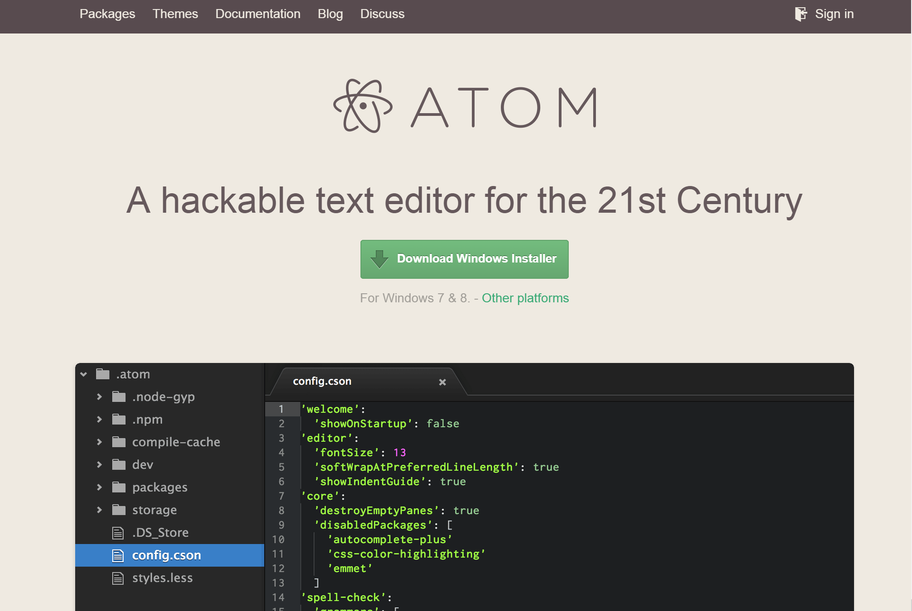
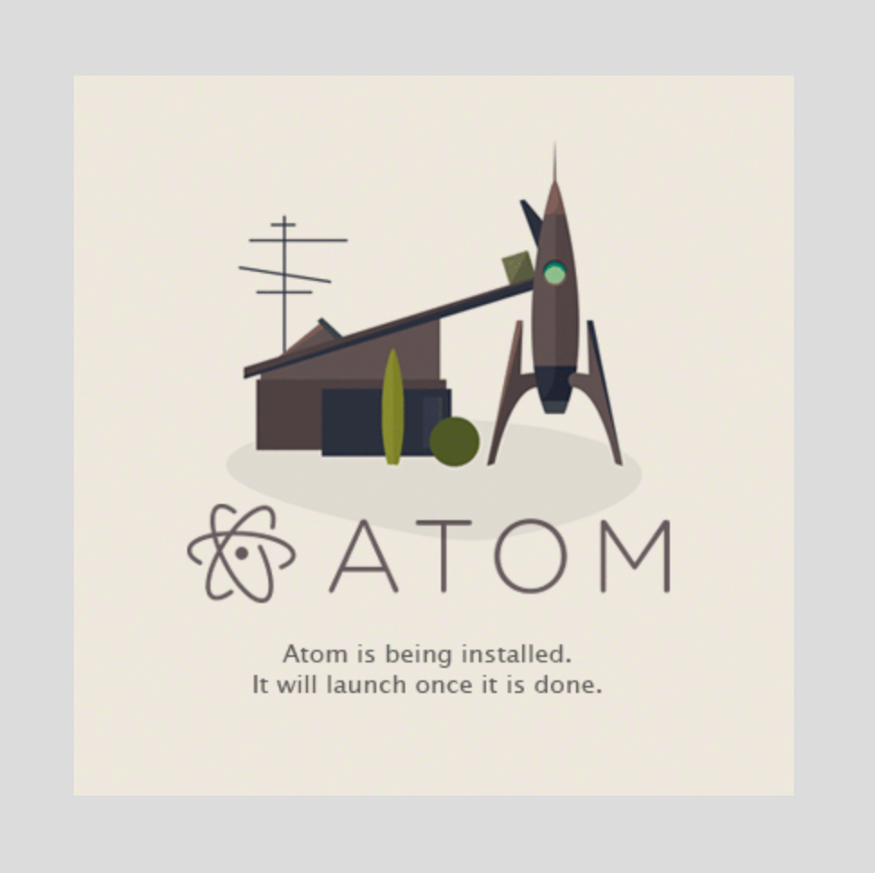
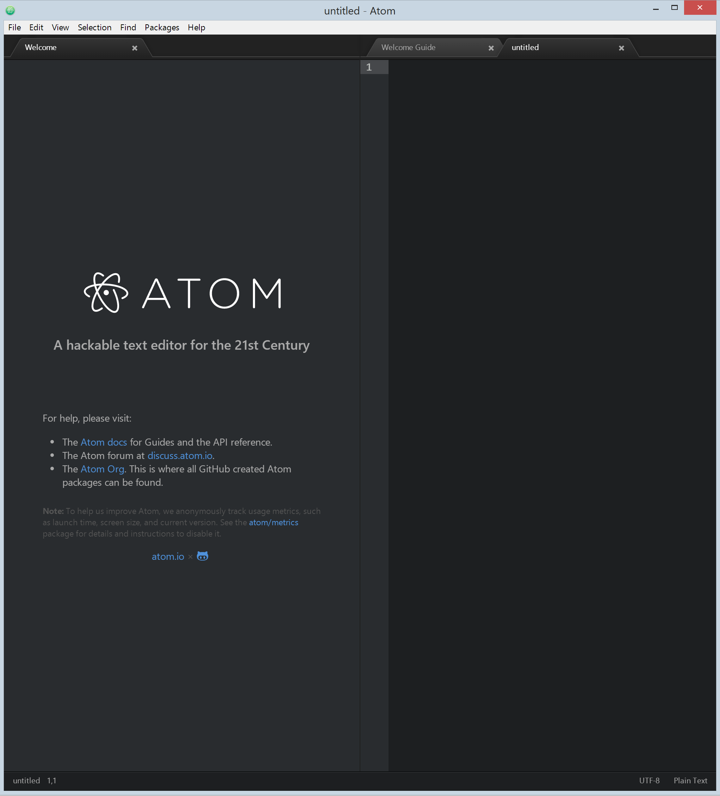

## Atom Installation

Download Atom from the [atom.io](http://atom.io) site.

The file that is downloaded, just double-click it to launch the installation process.

Once the installation process is done the editor will load as shown below.

### [⇐ Previous](terminal.md) | [Next ⇒](git.md)
