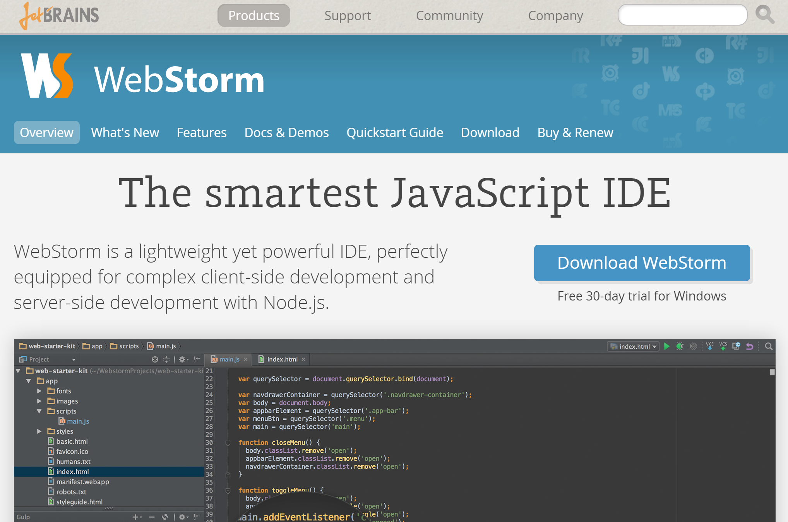
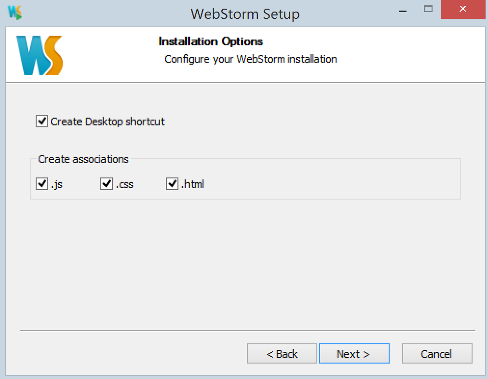

## WebStorm Installation

Download [WebStorm here]() and follow the installation wizard's instructions.

Upon double-clicking the WebStorm installation file the file will start an installation wizard. Click next to move through the wizard. You may want to set some of the settings specific to how you intend to use the IDE such as file associations shown below.

### [⇐ Previous](terminal.md) | [Next ⇒](git.md)
